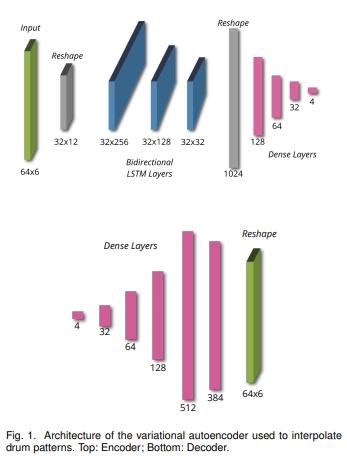

# midiocrity

## Populate the ./data folder
Run the following from the repo root to download the Clean MIDI subset of [The Lakh MIDI Dataset](https://colinraffel.com/projects/lmd/)

```
cd data
./getData.sh
```

## Environment Setup
To add the environment with conda, use the environment.yml file:
```
conda env create -f environment.yml
```

To update your environment, add dependencies to the environment.yml file adn then run:
```
conda env update -f environment.yml
```

## Architecture
We are using the architecture referenced in the [Off the Beaten Track](https://arxiv.org/pdf/1804.09808.pdf) paper.

